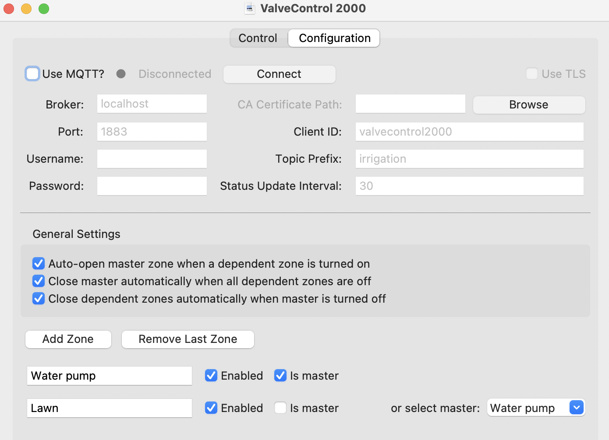
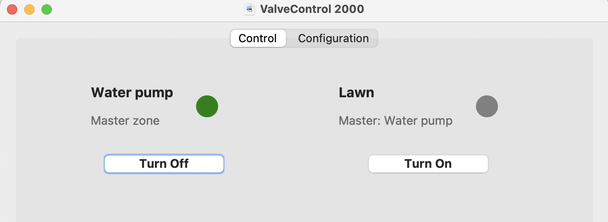
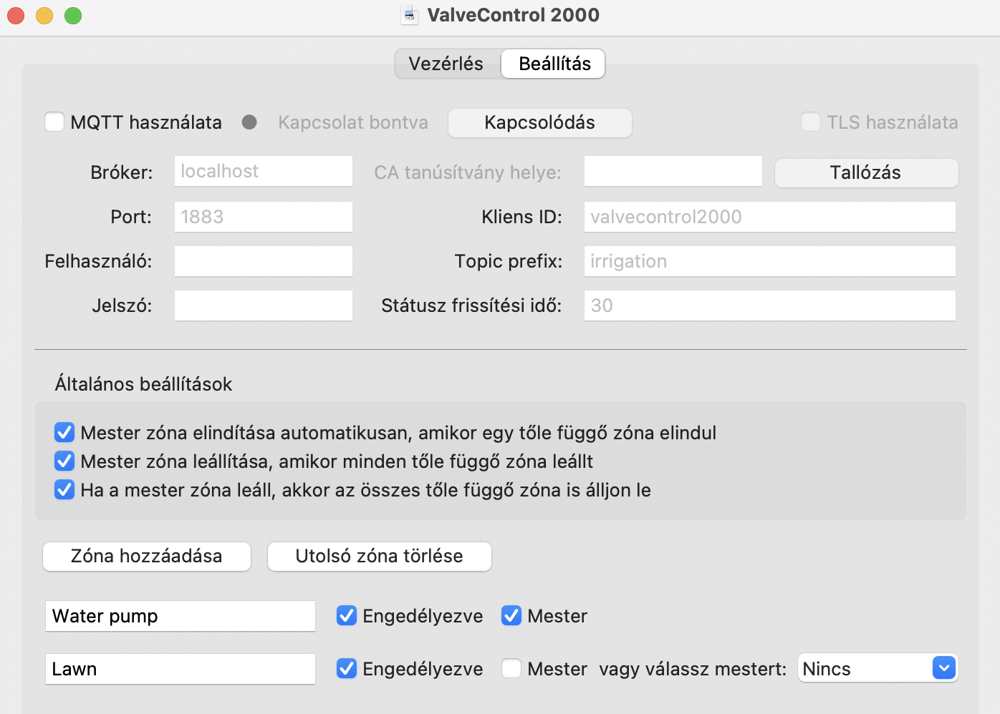
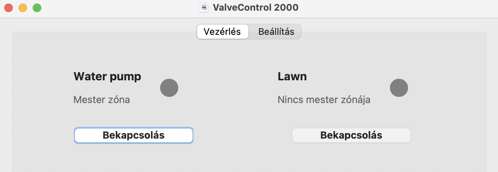

# ValveControl 2000
The purpose of this application is to control some valves in irrigation zones over MQTT using a GUI.

## Configuration tab

First use the "Add Zone" button to add more zones (maximal number of zones is 8 currently).  
Then name the zones as you like and select if it is a master zone (=has a valve or a water pump which controls a waterflow over a pipe which has multiple other valves on it) or it is a zone a dependent from a master zone, or it is just a simple zone (do not select the master checkbox and do not select a master from the list).  
You can also configure how the zones and their related master zones should behave when one of them is turned on or off.  
After that you should configure your MQTT broker access on the top and click on "Connect".

## MQTT topic structure
In this example the topic prefix will be: ```irrigation```

There's a state and a command topic for all the valves in the zones. Every zone has an id, ranging from 0-7, it is based on the order on the "Configuration" tab.

The state topic is used to control the GUI, so when a valve is turned on/off manually or by some other automation, your systems should send a message to the state topic of that zone to be able to have valid state information on the GUI.  
Topic and message format: ```{topic_prefix}/zone/{zone_id}/state on/off```  
Example messages:
```
irrigation/zone/0/state on
irrigation/zone/0/state off
```

The command topic is used to control the valves themselves, so when a zone is turned on/off on the GUI, we publish a message on the specific zone's topic. Your systems should react on the messages sent to the command topic of the zones to be able to switch on and off the valves.  
Topic and message format: ```{topic_prefix}/zone/{zone_id}/command on/off```  
Example messages:
```
irrigation/zone/0/command on
irrigation/zone/0/command off
```

## Using the control tab

On the control tab every zone has its name displayed and the master status below that (is it a master zone / or does it have a master zone / or is it just a simple zone without master).  
Below these info is a turn on/off button and next to it there's a circle which indicates the status. The circle is green when the zone is active.

## Loading and saving zone config files
You can find a "File" menu in the OS application header, select the appropriate action there. The last used zone configuration file's location is saved in ```settings.json``` and loaded automatically.  

## Changing language, adding new languages
You can find a "Language" menu in the OS application header, select the language there. Currently English and Hungarian languages are supported.  
If you would like to add a translation, then first edit the ```generate_translation_files.sh```, add the following:
```bash
NEW_LANGUAGE_CODE = "sth"
if [ ! -d "locales/$NEW_LANGUAGE_CODE/LC_MESSAGES" ]; then
    mkdir -p locales/$NEW_LANGUAGE_CODE/LC_MESSAGES
fi

if [ -f "locales/$NEW_LANGUAGE_CODE/LC_MESSAGES/messages.po" ]; then
    msgmerge -U locales/$NEW_LANGUAGE_CODE/LC_MESSAGES/messages.po locales/messages.pot
else
    msginit -l $NEW_LANGUAGE_CODE.UTF8 -o locales/$NEW_LANGUAGE_CODE/LC_MESSAGES/messages.po -i locales/messages.pot --no-translator
fi
```
and then add the new language to ```constants.py```:
```python
SUPPORTED_LANGUAGES = {
    'English': 'en',
    'Magyar': 'hu',
    'New lang': 'sth'
}
```
After these steps, generate the files to be translated by running: ```./generate_translation_files.sh```  
Translate the texts you can find in ```locales/$NEW_LANGUAGE_CODE/LC_MESSAGES/messages.po``` file and then run ```./compile_translations.sh```

## Running the application
Required python version: 3.12+
Install the requirements in a virtualenv and run the application like this:
```bash
python -m venv .venv
. ./.venv/bin/activate
pip install -r requirements.txt
python ./main.py
```

## Building and running the application (MacOS)
```bash
python -m venv .venv
. ./.venv/bin/activate
pip install -r requirements.txt
rm -rf build dist
python setup.py py2app
```
and then run it like:
```open -n ./dist/ValveControl\ 2000.app```

## Debugging errors
You can find your application settings file and the debug log in the following places:
- if you run the ```main.py``` directly: the ```settings.json``` and ```debug.log``` files will be placed in the same directory as ```main.py```
- if you build&run it on MacOS: ```~/Library/Application\ Support/ValveControl\ 2000```
- if you build&run it on Windows: ```C:\Documents and Settings\<username>\Local Settings\Application Data\GyB\ValveControl 2000```

# ValveControl 2000 (magyarul)
Az alkalmazás célja öntözési zónák szelepeinek vezérlése MQTT protokollon keresztül, grafikus felülettel.

## Beállítás fül

Először a "Zóna hozzáadása" gombbal adj hozzá további zónákat (jelenleg maximum 8 zóna lehet).  
Ezután nevezd el a zónákat tetszés szerint, és válaszd ki, hogy mester zóna-e (=olyan szelep-e vagy esetleg szivattyú, ami egy olyan vízvezetéket táplál, amin több másik szelep található), vagy egy mester zónától függő zóna, vagy csak egy egyszerű zóna (ne jelöld be a mester jelölőnégyzetet és ne válassz mester a lenyíló listából).  
Azt is beállíthatod, hogy a zónák és a hozzájuk tartozó mester zónák hogyan viselkedjenek, amikor valamelyiküket be- vagy kikapcsolják.  
Ezután konfiguráld az MQTT bróker hozzáférést felül, és kattints a "Kapcsolódás" gombra.

## MQTT téma struktúra
Ebben a példában a topic prefix: ```irrigation```

Minden zóna szelepéhez tartozik egy állapot (state) és egy parancs (command) topic. Minden zónának van egy azonosítója 0-7-ig, ami a "Konfiguráció" fülön lévő sorrenden alapul.

Az state topicot a GUI vezérlésére használjuk, így amikor egy szelepet manuálisan vagy valami más automatizmussal kapcsolsz be vagy ki, azoknak a rendszereknek üzenetet kell küldeniük az adott zóna state topicjára, hogy a GUI-n az aktuális állapotok jelenjenek meg.  
Topic és üzenet formátum: ```{topic_prefix}/zone/{zona_azonosito}/state on/off```  
Példa üzenetek:
```
irrigation/zone/0/state on
irrigation/zone/0/state off
```

A command topicot maguknak a szelepeknek a vezérlésére használjuk, így amikor egy zónát be/kikapcsolunk a felületen, egy üzenetet küldünk az adott zóna topicjára. A rendszereknek reagálniuk kell a zónák command topicjaira érkező üzenetekre, hogy kapcsolgatni tudják a szelepeket.  
Topic és üzenet formátum: ```{tema_előtag}/zone/{zona_azonosito}/command on/off```  
Példa üzenetek:
```
irrigation/zone/0/command on
irrigation/zone/0/command off
```

## A vezérlés fül használata

A vezérlő fülön minden zóna neve megjelenik, alatta a mester státusszal (mester zóna-e / van-e mester zónája / vagy egyszerű zóna mester nélkül).  
Ezek alatt található egy be/kikapcsoló gomb, mellette pedig egy kör, ami a státuszt jelzi. A kör akkor zöld színű, amikor az adott zóna aktív.

## Zóna konfigurációs fájlok betöltése és mentése
Az operációs rendszer applikációs fejlécében van egy "Fájl" menü, abból válaszd ki ott a megfelelő műveletet. Az utoljára használt zóna konfigurációs fájl helye a ```settings.json```-ben kerül mentésre és automatikusan betöltődik.

## Nyelv változtatása, új nyelvek hozzáadása
Az operációs rendszer applikációs fejlécében van egy "Nyelv" menü, ott választhatod ki a nyelvet. Jelenleg az angol és a magyar nyelv támogatott.  
Ha szeretnél új fordítást hozzáadni, először szerkeszd a ```generate_translation_files.sh``` fájlt, add hozzá a következőt:
```bash
NEW_LANGUAGE_CODE = "sth"
if [ ! -d "locales/$NEW_LANGUAGE_CODE/LC_MESSAGES" ]; then
    mkdir -p locales/$NEW_LANGUAGE_CODE/LC_MESSAGES
fi

if [ -f "locales/$NEW_LANGUAGE_CODE/LC_MESSAGES/messages.po" ]; then
    msgmerge -U locales/$NEW_LANGUAGE_CODE/LC_MESSAGES/messages.po locales/messages.pot
else
    msginit -l $NEW_LANGUAGE_CODE.UTF8 -o locales/$NEW_LANGUAGE_CODE/LC_MESSAGES/messages.po -i locales/messages.pot --no-translator
fi
```
majd add hozzá az új nyelvet a ```constants.py```-hoz:
```python
SUPPORTED_LANGUAGES = {
    'English': 'en',
    'Magyar': 'hu',
    'Új nyelv': 'sth'
}
```
Ezek után generáld le a fordítandó fájlokat a következő paranccsal: ```./generate_translation_files.sh```  
Fordítsd le a szövegeket, amiket a ```locales/$NEW_LANGUAGE_CODE/LC_MESSAGES/messages.po``` fájlban találsz, majd futtasd a ```./compile_translations.sh``` parancsot.

## Az alkalmazás futtatása
Szükséges Python verzió: 3.12+
Telepítsd a követelményeket egy virtualenv-be és futtasd az alkalmazást így:
```bash
python -m venv .venv
. ./.venv/bin/activate
pip install -r requirements.txt
python ./main.py
```

## Az alkalmazás buildelése és futtatása (MacOS)
```bash
python -m venv .venv
. ./.venv/bin/activate
pip install -r requirements.txt
rm -rf build dist
python setup.py py2app
```
majd futtasd így:
```open -n ./dist/ValveControl\ 2000.app```

## Hibák debuggolása
Az alkalmazás beállítási fájlját és a debug logot a következő helyeken találod:
- ha közvetlenül a ```main.py```-t futtatod: a ```settings.json``` és ```debug.log``` fájlok ugyanabba a könyvtárba kerülnek, mint a ```main.py```
- ha MacOS-en buildeled és futtatod: ```~/Library/Application\ Support/ValveControl\ 2000```
- ha Windows-on buildeled és futtatod: ```C:\Documents and Settings\<username>\Local Settings\Application Data\GyB\ValveControl 2000```